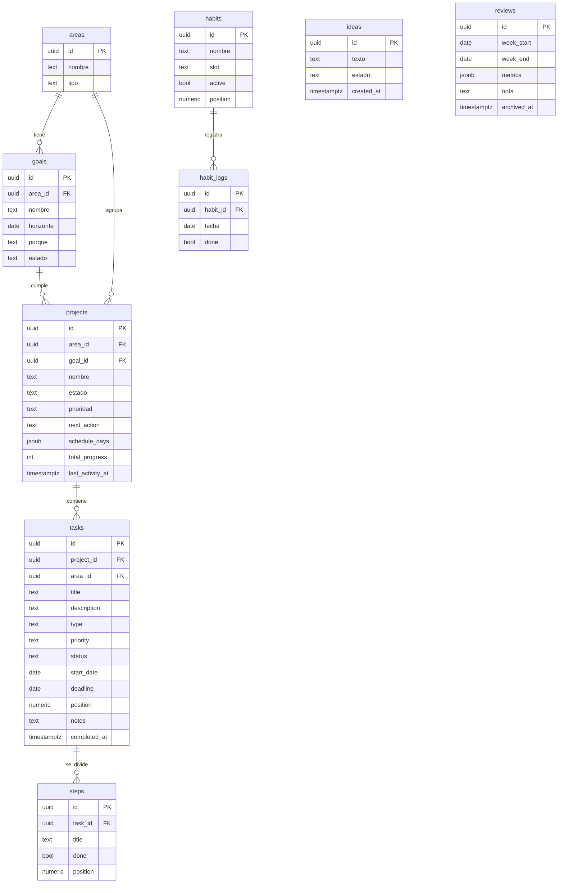

# Modelo de datos

PostgreSQL. Relaciones: `areas` 1—N `goals` 1—N `projects` 1—N `tasks` 1—N `steps`.
`habits` 1—N `habit_logs`. `ideas` y `reviews` son independientes.

## Notas de diseño

- **`position` como `numeric`** (no int): permite reordenar insertando entre dos
  valores (p. ej. 1.5 entre 1 y 2) sin re-numerar toda la lista. El endpoint de
  reorder calcula el punto medio.
- **`schedule_days`**: array de enteros 0–6 (0 = domingo) o texto `["lun","mie"]`.
  "Hoy toca" = `today_weekday ∈ schedule_days`.
- **% semana de un proyecto** = tareas del proyecto con `deadline` en la semana y
  `status = hecha` / total de tareas del proyecto con `deadline` en la semana.
  Se calcula en consulta, no se almacena.
- **% del día de hábitos** = `habit_logs` done de hoy / hábitos activos.
- **Racha**: recorrer hacia atrás días consecutivos con % = 100% (o umbral). Se puede
  calcular al vuelo o cachear en una tabla `streaks` si crece el volumen.
- **Incumplimiento** = `deadline < current_date AND status <> 'hecha'`.
- **Subtarea completa la tarea**: al marcar el último `step`, un trigger o la capa de
  servicio setea `tasks.status = 'hecha'`. Recomendado hacerlo en el servicio (más
  controlable que un trigger de DB).

Ver `supabase/migrations/` para el DDL ejecutable (con `user_id` y RLS por tabla).
