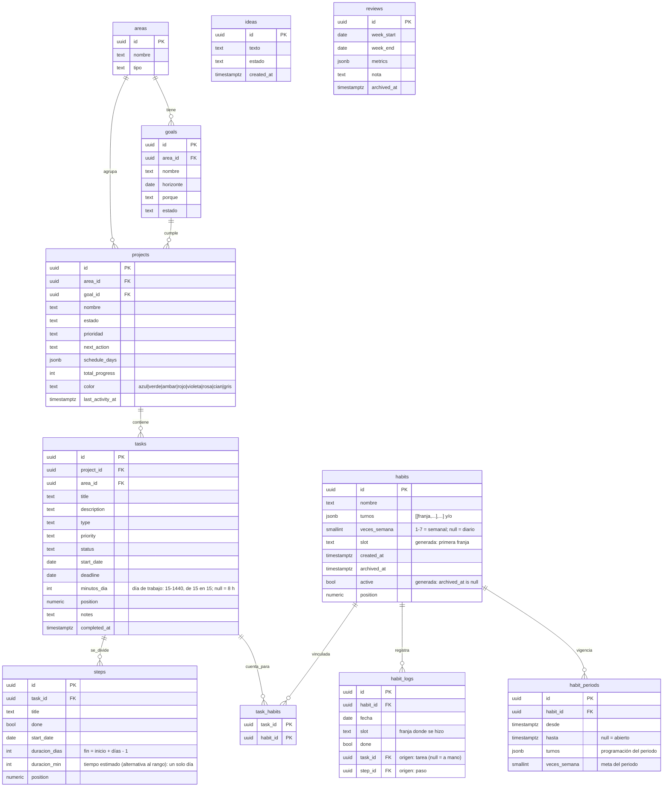

# Modelo de datos

PostgreSQL. Relaciones: `areas` 1—N `goals` 1—N `projects` 1—N `tasks` 1—N `steps`.
`habits` 1—N `habit_logs`. `tasks` N—M `habits` vía `task_habits`. `ideas` y `reviews` son independientes.

## Notas de diseño

- **`position` como `numeric`** (no int): permite reordenar insertando entre dos
  valores (p. ej. 1.5 entre 1 y 2) sin re-numerar toda la lista. El endpoint de
  reorder calcula el punto medio.
- **`schedule_days`**: array de enteros 0–6 (0 = domingo) o texto `["lun","mie"]`.
  "Hoy toca" = `today_weekday ∈ schedule_days`.
- **% semana de un proyecto** = tareas del proyecto con `deadline` en la semana y
  `status = hecha` / total de tareas del proyecto con `deadline` en la semana.
  Se calcula en consulta, no se almacena.
- **% del día de hábitos** = turnos hechos hoy / turnos de los hábitos diarios vigentes hoy
  (los semanales no cuentan, ni en la racha).
- **% semanal de hábitos** (revisión) = (turnos hechos de los días transcurridos + Σ min(días hechos, meta)
  de los semanales) / (turnos vigentes de esos días + Σ metas).
- **Tarea → hábito** (triggers `tasks_sync_habitos` y `steps_sync_habitos`): al pasar a hecha la tarea o un
  paso, `marcar_habitos_por_tarea` registra hoy los hábitos de `task_habits` con `task_id`/`step_id` como
  origen; al deshacerse, borra solo esos registros. El día y la franja locales salen de `hora_local()`,
  que lee la zona IANA de la cabecera `x-timezone` que manda el cliente (UTC si falta).
- **Racha**: recorrer hacia atrás días consecutivos con % = 100% (o umbral) de los turnos vigentes ese día. Se puede
  calcular al vuelo o cachear en una tabla `streaks` si crece el volumen.
- **Incumplimiento** = `deadline < current_date AND status <> 'hecha'`.
- **Duración de la tarea y de sus pasos** (ver la sección de abajo): `(deadline − start_date + 1) × minutos_dia`.
  Se calcula en el cliente; no se almacena.
- **Subtarea completa la tarea**: al marcar el último `step`, un trigger o la capa de
  servicio setea `tasks.status = 'hecha'`. Recomendado hacerlo en el servicio (más
  controlable que un trigger de DB).

Ver `supabase/migrations/` para el DDL ejecutable (con `user_id` y RLS por tabla).

- **`aplicar_plan(cambios jsonb)`** (RPC, `security invoker`): aplica en una transacción los cambios del Gantt — `{"tasks":[{id,start_date,deadline}],"steps":[{id,start_date,duracion_dias,duracion_min?}]}` (sin `duracion_min`, no se toca) —; una fila ajena o inexistente (`P0002`) o un CHECK violado aborta todo.

## Duración de la tarea y de sus pasos (contrato para todos los clientes)

Esta regla vale para la web, la app móvil y la de escritorio. La lógica pura está en
`packages/shared/src/domain/pasos.ts`. Un cliente en TypeScript (Capacitor, Tauri,
Electron…) debe **importarla de `@sb/shared`** y no reescribirla. Un cliente nativo
(Swift, Kotlin…) debe replicar exactamente lo de abajo y copiar como casos de prueba
los de `pasos.test.ts` («duración de la tarea») y `agente.test.ts` (`programarPaso`).

| Concepto | Regla | En `@sb/shared` |
|---|---|---|
| Día de trabajo | `tasks.minutos_dia`; si es null, 480 (8 h). | `minutosDia(t)`, `JORNADA_MIN` |
| Días de la tarea | `deadline − start_date + 1`; null si falta un lado o el fin es antes del inicio. | `diasTarea(t)` |
| Duración de la tarea | días × día de trabajo, en minutos. | `presupuestoTarea(...).total` |
| Minutos de un paso | Por tiempo, `duracion_min`. Por días, `duracion_dias × minutosDia`. Sin fecha, 0. | `minutosPaso(p, t)` |
| Presupuesto | Suma de los minutos de los pasos, hechos incluidos, frente a la duración; `excede` si la pasa. Se muestra en días de trabajo («2 días 3 h de 5 días»). | `presupuestoTarea(pasos, t)`, `duracionEnDias(min, dia)` |
| Paso solo con tiempo | Sin `start_date` y con `duracion_min`: `start_date = tasks.start_date`, `duracion_dias = 1`. Si la tarea no tiene inicio, el paso no se puede guardar con tiempo (la base exige fecha: CHECK `steps_tiempo_un_dia`). | `completarPaso(p, t)` |
| Paso con fecha y sin días | `duracion_dias` = hasta el deadline (`deadline − start_date + 1`); 1 si no hay deadline o el paso empieza después. | `completarPaso(p, t)` |
| Encadenar | Desde el inicio de la tarea (hoy si no tiene). Por días, uno tras otro. Por tiempo, en el mismo día mientras quepan en `minutosDia`; el que no cabe pasa al día siguiente. Después se cuentan los que quedan fuera de plazo y se avisa. | `encadenar(pasos, desde, minutosDia(t))`, `fueraDePlazo` |
| Escala de un día | Los pasos por tiempo de un día se dibujan y totalizan sobre `minutosDia`: el detalle del día del calendario («3 h de 4 h») y el ancho de un día en el Gantt con zoom. | `tramosDelDia` + `minutosDia` |
| Agentes (WebMCP) | `programarPaso(actual, cambios, tarea)` aplica las dos reglas de `completarPaso`. `encadenarTarea` usa el día de trabajo de la tarea. `get_task` devuelve `minutosDia` y `presupuesto`. | `domain/agente.ts` |

Notas:
- Las fechas que se completan con la tarea se **escriben** en la base al guardar. Si
  después cambia el inicio de la tarea, el paso no se mueve solo: hay que reprogramarlo
  o encadenar de nuevo.
- En el formulario, «h/día» admite cuartos de hora (`0.25`). Se redondea a 15 min y se
  limita a 15 min–24 h, como exige el CHECK `tasks_minutos_dia`. Vacío guarda null.
